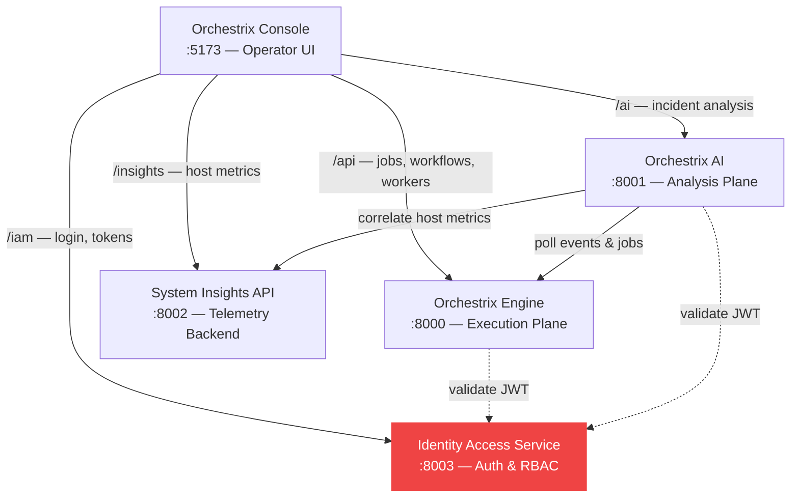

# Identity Access Service

**The shared auth layer of the [Orchestrix Platform](https://github.com/Yogevso/Orchestrix-Platform).** Owns authentication, authorization, and tenant isolation. Emits JWTs with `sub`, `role`, `tenant_id` claims consumed by Engine, AI, and Console. Provides refresh token rotation, RBAC enforcement, and audit logging for all platform services.

Production-style Identity and Access Management (IAM) service built with FastAPI, PostgreSQL, SQLAlchemy, Alembic, Docker Compose, and GitHub Actions. Covers authentication, authorization, tenant isolation, auditability, operational hardening, and local deployment workflows.

## Part of the Orchestrix Platform

Identity Access Service is the **shared authentication and authorization layer** of the Orchestrix Platform — it issues and validates JWTs used by all platform services for tenant-scoped, role-based access control.

| Service | Role | Interaction |
|---------|------|-------------|
| **[Orchestrix Engine](https://github.com/Yogevso/Orchestrix-Engine)** | Execution plane | Validates IAM-issued JWTs to enforce tenant scoping on jobs, workflows, and admin actions |
| **[Orchestrix Console](https://github.com/Yogevso/orchestrix-console)** | Operator UI | Authenticates operators via IAM login and passes bearer tokens to all platform APIs |
| **[Orchestrix AI](https://github.com/Yogevso/orchestrix-ai)** | Analysis plane | Validates tokens for tenant-scoped access to privileged analysis endpoints |
| **[System Insights API](https://github.com/Yogevso/system-insights-api)** | Telemetry backend | Planned JWT validation for protected telemetry queries |

**Data this service provides:**
- JWT access tokens with claims: `sub`, `role`, `tenant_id`
- Refresh token rotation for session continuity
- User profile and tenant context via `GET /api/v1/auth/me`
- Audit logs for all auth and admin events

### Platform Architecture



## Why This Project

Identity and access control sit at the center of most modern SaaS systems. Authentication, authorization, tenant isolation, and auditability are not side concerns. They shape how a product enforces trust, protects customer data, and scales safely across organizations.

This project exists to demonstrate that layer as a standalone backend service. It focuses on the kinds of concerns engineering teams deal with in real systems:

- Secure token-based authentication
- Role-based access control across multiple actor types
- Strong tenant boundaries for SaaS-style data isolation
- Auditable security-sensitive actions
- Operational safeguards such as login protection, rate limiting, and bootstrap admin recovery

For recruiters and reviewers, the value of this project is not only the API surface. It shows system design thinking, practical backend architecture, and security-aware implementation choices.

## Key Capabilities

- JWT-based authentication with refresh token rotation
- Role-based access control with `SYS_ADMIN`, `TENANT_ADMIN`, and `USER`
- Multi-tenant data isolation with tenant-aware service logic
- Audit logging for security-sensitive actions
- Login protection with lockout and request-level rate limiting
- Dockerized local environment with CI-backed test coverage

## Current Scope

This milestone includes:

- FastAPI application factory with versioned routing
- Database configuration and SQLAlchemy session management
- Core domain models for tenants, users, refresh tokens, and audit logs
- Alembic migration scaffolding and versioned schema changes
- `/api/v1/health` endpoint with database connectivity check
- Auth endpoints for tenant signup, login, refresh rotation, and logout
- Login-attempt protection with temporary account lockout for repeated failures
- Request-level rate limiting on auth login, register, and refresh endpoints
- JWT-backed principal resolution and RBAC-protected example routes
- Tenant CRUD and tenant-scoped user listing with isolation checks
- Tenant-admin and system-admin user management with role changes and deactivation
- Queryable audit log APIs for tenant and system administrators
- Bootstrap command for idempotent system-admin provisioning and recovery
- Consistent JSON error envelope for validation, auth, permission, conflict, not-found, and rate-limit responses
- Dockerfile, Docker Compose, and CI workflow
- Integration and service tests for health, auth, RBAC, rate limits, bootstrap, tenancy, user-management, and audit flows

The detailed product specification and phased execution plan live in:

- [docs/prd.md](docs/prd.md)
- [docs/execution-plan.md](docs/execution-plan.md)

## Architecture Overview

Core components:

- FastAPI provides the HTTP API layer, dependency injection, OpenAPI docs, and route organization.
- PostgreSQL is the primary persistence target, with SQLAlchemy for ORM mapping and Alembic for schema migrations.
- JWT access tokens are used for short-lived API authentication.
- Opaque refresh tokens are stored hashed at rest and rotated on refresh.
- Docker Compose provides local orchestration for the API and database.
- GitHub Actions runs linting and tests in CI.

Key design decisions:

- Tenant isolation is enforced in the service layer, not only at the route layer, so cross-tenant access is denied by design.
- Refresh tokens are never stored in plaintext, which reduces blast radius if database data is exposed.
- Security-relevant actions are written to audit logs so admin activity and auth events remain traceable.
- Error handling uses a consistent JSON envelope across validation, auth, permission, and conflict paths.
- Login protection combines account lockout with request throttling to reduce brute-force and abuse risk.
- Bootstrap admin creation is implemented as an explicit management command rather than hidden application startup behavior.

## Example Flow: Login

1. A user submits tenant slug, email, and password to `POST /api/v1/auth/login`.
2. The service resolves the tenant, validates the user, checks lockout state, and verifies the password hash.
3. On success, it issues a short-lived JWT access token and a rotated refresh token.
4. The refresh token is stored hashed in the database, and the login event is written to the audit log.
5. Future protected requests use the access token, and refresh requests rotate the refresh token again.

## Quick Start

1. Copy `.env.example` to `.env`.
2. Start the stack:

```bash
docker compose up --build
```

3. Open:

- API docs: `http://localhost:8000/docs`
- Health check: `http://localhost:8000/api/v1/health`

Key auth and admin endpoints:

- `POST /api/v1/auth/register`
- `POST /api/v1/auth/login`
- `POST /api/v1/auth/refresh`
- `POST /api/v1/auth/logout`
- `GET /api/v1/auth/me`
- `GET /api/v1/admin/tenant/summary`
- `GET /api/v1/admin/system/summary`
- `GET /api/v1/tenants/me`
- `GET /api/v1/tenants/{tenant_id}`
- `GET /api/v1/tenants/{tenant_id}/users`
- `GET /api/v1/tenants`
- `POST /api/v1/tenants`
- `PATCH /api/v1/tenants/{tenant_id}`
- `POST /api/v1/tenants/{tenant_id}/users`
- `PATCH /api/v1/tenants/{tenant_id}/users/{user_id}/role`
- `DELETE /api/v1/tenants/{tenant_id}/users/{user_id}`
- `GET /api/v1/audit-logs`
- `GET /api/v1/tenants/{tenant_id}/audit-logs`

## Local Development

Install dependencies:

```bash
python -m pip install --upgrade pip
python -m pip install .[dev]
```

Run the API:

```bash
uvicorn app.main:app --reload
```

Run checks:

```bash
ruff check .
pytest
alembic upgrade head
```

## Error Model

Non-success responses use a consistent envelope:

```json
{
  "error": {
    "code": "forbidden",
    "message": "You do not have permission to perform this action.",
    "details": null
  }
}
```

Validation failures use `code: "validation_error"` and populate `details` with field-level items.

## Auth Hardening

- Access tokens are short-lived JWTs; refresh tokens are opaque, hashed at rest, rotated on refresh, and revocable on logout or user deactivation.
- Repeated failed login attempts against a valid active account trigger a temporary account lockout.
- The login endpoint keeps returning the same `401` error for invalid credentials, inactive accounts, and active lockouts to reduce account-enumeration leakage.
- Auth entrypoints return `429` with `Retry-After`, `X-RateLimit-Limit`, and `X-RateLimit-Remaining` headers when request limits are exceeded.

Relevant settings in `.env`:

- `MAX_FAILED_LOGIN_ATTEMPTS`
- `LOGIN_LOCKOUT_MINUTES`
- `RATE_LIMIT_WINDOW_SECONDS`
- `LOGIN_RATE_LIMIT_REQUESTS`
- `REGISTER_RATE_LIMIT_REQUESTS`
- `REFRESH_RATE_LIMIT_REQUESTS`

The current rate limiter is in-memory and process-local. That is appropriate for local development and a single app instance, but production deployment behind multiple app replicas should move the counters to a shared backend such as Redis.

## Bootstrap Admin

Create or recover the initial system administrator locally:

```bash
iam-bootstrap-admin \
  --tenant-name "Platform" \
  --tenant-slug platform \
  --full-name "System Admin" \
  --email admin@platform.example
```

Run the same workflow in Docker:

```bash
docker compose run --rm api iam-bootstrap-admin \
  --tenant-name "Platform" \
  --tenant-slug platform \
  --full-name "System Admin" \
  --email admin@platform.example
```

Notes:

- The command is idempotent for an existing `SYS_ADMIN` in the target tenant.
- It reactivates an existing system admin, clears temporary login lockouts, and can rotate the password with `--reset-password`.
- It fails if the target email already exists in the tenant with a non-`SYS_ADMIN` role.

## Project Layout

```text
identity-access-service/
|-- alembic/
|-- app/
|   |-- api/
|   |-- core/
|   |-- db/
|   |-- management/
|   |-- models/
|   |-- schemas/
|   |-- services/
|   `-- main.py
|-- docs/
|-- tests/
|-- .github/workflows/
|-- docker-compose.yml
|-- Dockerfile
`-- pyproject.toml
```

## Next Engineering Steps

The current milestone is stable and complete for its intended scope. The strongest next steps, if this project continues, are:

- Shared-state rate limiting for multi-instance deployments
- Structured observability such as request IDs, metrics, and audit export
- Deployment polish including production profiles, backup workflows, and operational runbooks
